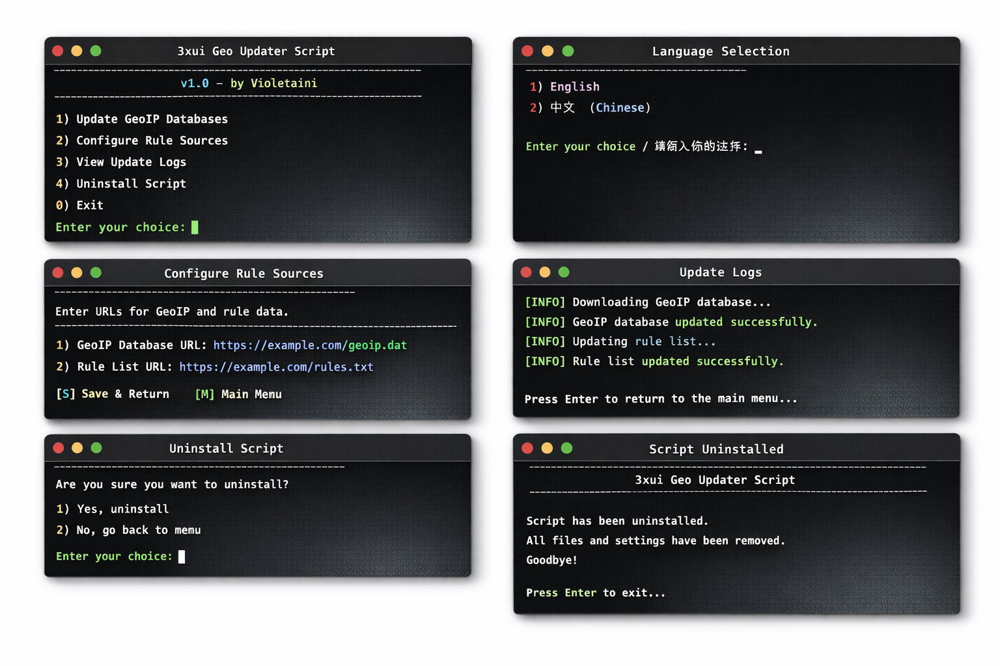

# 3xui Geo Updater

[English](README.md) | [简体中文](README_zh.md) | [日本語](README_ja.md) | [Русский](README_ru.md) | [فارسی](README_fa.md)

یک ابزار سبک و چندزبانه برای به‌روزرسانی خودکار فایل‌های Geo در **3x-ui**، با قابلیت انتخاب منبع، زمان‌بندی به‌روزرسانی، ثبت لاگ و راه‌اندازی مجدد ایمن.



این ابزار به شما کمک می‌کند تا فایل‌های قوانین مرتبط با Geo را برای سرورهای مبتنی بر 3x-ui همیشه به‌روز نگه دارید، در حالی که از ری‌استارت‌های غیرضروری جلوگیری می‌کند. این پروژه از چندین منبع بالادستی، زمان‌بندی منعطف، منوی خط فرمان ساده پشتیبانی کرده و **تنها زمانی که فایل‌ها واقعاً تغییر کنند** سرویس را ری‌استارت می‌کند.

## ویژگی‌ها

- رابط چندزبانه
  - چینی ساده‌شده (Simplified Chinese)
  - انگلیسی (English)
  - روسی (Russian)
  - فارسی (Persian)
- انتخاب زبان در اولین اجرا
- پشتیبانی از چندین منبع قوانین Geo
- پشتیبانی از انتخاب یک یا چند منبع
- حالت‌های به‌روزرسانی زمان‌بندی‌شده
  - روزانه
  - هفتگی
  - هر N روز
  - عبارت سفارشی cron
- زمان اجرای پیش‌فرض: **03:00**
- ری‌استارت کردن **x-ui فقط در صورت تغییر واقعی فایل‌ها**
- پشتیبانی از ثبت لاگ
- گزینه حذف نصب داخلی
- منوی مدیریت Swap (حافظه مجازی) داخلی
- دستورات میانبر:
  - `xgeo`
  - `3xui-geo`
- انتخاب خودکار بک‌اند زمان‌بندی
  - سیستم‌های استاندارد از cron سیستم استفاده می‌کنند
  - سیستم‌های مبتنی بر RHEL با حافظه کم به‌طور خودکار از **Supercronic** استفاده می‌کنند
- حالت Supercronic شامل:
  - مدیریت سرویس systemd
  - راه‌اندازی خودکار هنگام بوت
  - راه‌اندازی مجدد خودکار در صورت خرابی

## منابع پشتیبانی‌شده

این پروژه در حال حاضر از منابع قوانین Geo زیر پشتیبانی می‌کند:

1. **Loyalsoldier**
   - `geoip.dat`
   - `geosite.dat`

2. **chocolate4u**
   - `geoip_IR.dat`
   - `geosite_IR.dat`

3. **runetfreedom**
   - `geoip_RU.dat`
   - `geosite_RU.dat`

## نحوه عملکرد

این ابزار به‌روزرسانی، آخرین فایل‌های Geo را از منابع پیکربندی‌شده دانلود می‌کند، آن‌ها را با فایل‌های محلی نصب‌شده مقایسه کرده و تنها در صورتی که محتوای فایل تغییر کرده باشد، آن‌ها را جایگزین می‌کند.

اگر حداقل یکی از فایل‌های انتخاب‌شده تغییر کند، اسکریپت سرویس `x-ui` را ری‌استارت می‌کند تا داده‌های جدید Geo اعمال شوند.

اگر هیچ تغییری رخ ندهد، **هیچ ری‌استارتی انجام نخواهد شد**.

## چرا این پروژه ایجاد شد

اگرچه 3x-ui در حال حاضر گزینه به‌روزرسانی دستی فایل‌های Geo را ارائه می‌دهد، اما بسیاری از کاربران به دنبال یک جریان کاری ایمن‌تر و خودکارتر هستند.

این پروژه ویژگی‌های زیر را اضافه می‌کند:

- اجرای زمان‌بندی‌شده
- انتخاب منبع
- مدیریت تعاملی چندزبانه
- ثبت لاگ
- منطق ری‌استارت فقط در صورت تغییر
- انتخاب زبان در اولین اجرا
- تجربه عملیاتی راحت‌تر برای نگهداری طولانی‌مدت

## پیش‌نیازها

- سرور لینوکس
- نصب بودن `3x-ui`
- دسترسی Root
- در دسترس بودن ابزارهای رایج سیستم:
  - `bash`, `curl`, `cmp`, `install`, `awk`, `grep`, `mktemp`, `date`, `xargs`

این نصب‌کننده بیشتر به ابزارهای متداول لینوکس وابسته است که معمولاً در سیستم‌های استاندارد لینوکس در دسترس هستند.

در سیستم‌های استاندارد، نصب‌کننده در صورت نیاز تلاش می‌کند cron را به‌طور خودکار نصب و راه‌اندازی کند.
در سیستم‌های پشتیبانی‌شده مبتنی بر RHEL با حافظه کم، نصب‌کننده به‌جای تکیه بر cron سیستم، به‌طور خودکار به **Supercronic** سوئیچ می‌کند.

## نصب

### نصب سریع
نصب‌کننده به‌طور خودکار بک‌اند زمان‌بندی را انتخاب می‌کند:
- در سیستم‌های استاندارد، از cron سیستم استفاده می‌کند و در صورت نیاز آن را نصب/راه‌اندازی می‌کند.
- در سیستم‌های مبتنی بر RHEL با حافظه کم، به‌طور خودکار به **Supercronic** سوئیچ می‌کند.
```bash
curl -fsSL -o install-3xui-geo-updater.sh [https://raw.githubusercontent.com/violetaini/3xui-geo-auto-update/main/install-3xui-geo-updater.sh](https://raw.githubusercontent.com/violetaini/3xui-geo-auto-update/main/install-3xui-geo-updater.sh) && chmod +x install-3xui-geo-updater.sh && bash install-3xui-geo-updater.sh
```

### ۱. دانلود اسکریپت نصب

اسکریپت نصب را روی سرور خود قرار دهید، برای مثال:

```bash
curl -fsSL -o install-3xui-geo-updater.sh [https://raw.githubusercontent.com/violetaini/3xui-geo-auto-update/main/install-3xui-geo-updater.sh](https://raw.githubusercontent.com/violetaini/3xui-geo-auto-update/main/install-3xui-geo-updater.sh)
```

یا مخزن را کلون کنید:

```bash
git clone [https://github.com/violetaini/3xui-geo-auto-update.git](https://github.com/violetaini/3xui-geo-auto-update.git)
cd 3xui-geo-auto-update
```

### ۲. دادن دسترسی اجرایی

```bash
chmod +x install-3xui-geo-updater.sh
```

### ۳. اجرای نصب‌کننده با دسترسی root

```bash
sudo bash install-3xui-geo-updater.sh
```

پس از نصب، منوی مدیریت به‌طور خودکار شروع به کار می‌کند.

### اولین اجرا
در اولین اجرا، اسکریپت از شما می‌خواهد پیش از ورود به منوی اصلی، یک زبان را انتخاب کنید.
پس از آن، زبان انتخاب‌شده ذخیره شده و به‌طور خودکار استفاده می‌شود.

## استفاده

**باز کردن منوی مدیریت:**

```bash
xgeo
```

یا

```bash
3xui-geo
```

**اجرای دستی بررسی به‌روزرسانی:**
منو را باز کرده و گزینه `اجرای بررسی به‌روزرسانی در حال حاضر` را انتخاب کنید.

**حذف نصب:**

```bash
xgeo uninstall
```

همچنین می‌توانید از طریق منوی مدیریت اقدام به حذف نصب کنید.

## نمای کلی منو

منوی مدیریت از امکانات زیر پشتیبانی می‌کند:

- پیکربندی یا ویرایش به‌روزرسانی خودکار
- اجرای بررسی به‌روزرسانی در حال حاضر
- مشاهده لاگ‌ها
- مشاهده پیکربندی فعلی
- تغییر زبان
- حذف وظیفه زمان‌بندی‌شده
- مدیریت Swap
- حذف نصب اسکریپت

## حالت‌های زمان‌بندی

این ابزار از حالت‌های زمان‌بندی زیر پشتیبانی می‌کند:

- **روزانه (Daily):** هر روز ساعت 03:00 اجرا می‌شود
- **هفتگی (Weekly):** هفته‌ای یک بار در ساعت 03:00 در روز انتخابی اجرا می‌شود
- **هر N روز:** هر N روز یک بار در ساعت 03:00 اجرا می‌شود
- **عبارت سفارشی (Custom Cron):** برای کاربران حرفه‌ای که کنترل کامل بر روی زمان‌بندی می‌خواهند

## بک‌اند زمان‌بندی (Scheduler Backend)

این پروژه از دو بک‌اند زمان‌بندی پشتیبانی می‌کند:

### ۱. cron سیستم
در سیستم‌های استاندارد استفاده می‌شود.
اگر cron وجود نداشته باشد، نصب‌کننده تلاش می‌کند آن را به‌طور خودکار نصب و راه‌اندازی کند.

### ۲. Supercronic
به‌طور خودکار در سیستم‌های پشتیبانی‌شده مبتنی بر RHEL با حافظه کم استفاده می‌شود.

در حال حاضر، حالت Supercronic در سیستم‌های زیر زمانی که کل حافظه (RAM) کمتر از **2 GiB** باشد، اجباری است:
- Anolis
- CentOS Stream
- Oracle Linux
- AlmaLinux
- Rocky Linux
- Alibaba Cloud Linux

در حالت Supercronic، نصب‌کننده اقدامات زیر را انجام می‌دهد:
- دانلود باینری مستقل Supercronic
- ایجاد یک فایل اختصاصی crontab
- ایجاد یک سرویس systemd
- فعال‌سازی راه‌اندازی خودکار هنگام بوت
- فعال‌سازی راه‌اندازی مجدد خودکار در صورت خرابی

## ثبت لاگ

فایل لاگ پیش‌فرض:

```bash
/var/log/3xui-geo-updater.log
```

مشاهده ۵۰ خط آخر:

```bash
tail -n 50 /var/log/3xui-geo-updater.log
```

پیگیری زنده لاگ‌ها:

```bash
tail -f /var/log/3xui-geo-updater.log
```

## اجزای نصب‌شده

نصب‌کننده فایل‌های زیر را ایجاد می‌کند:

- `/usr/local/bin/3xui-geo-runner.sh`
- `/usr/local/bin/3xui-geo-manager.sh`
- `/usr/local/bin/3xui-geo-uninstall.sh`
- `/usr/local/bin/xgeo`
- `/usr/local/bin/3xui-geo`

فایل پیکربندی:
- `/etc/3xui-geo-updater.conf`

پوشه وضعیت:
- `/var/lib/3xui-geo-updater`

فایل لاگ:
- `/var/log/3xui-geo-updater.log`

هنگامی که حالت Supercronic فعال باشد، نصب‌کننده فایل‌های زیر را نیز ایجاد می‌کند:
- `/usr/local/bin/supercronic`
- `/etc/3xui-geo-updater.cron`
- `/etc/systemd/system/3xui-geo-supercronic.service`

## رفتار ایمنی

این پروژه شامل چندین رفتار مبتنی بر ایمنی است:

- مقایسه محتوای فایل قبل از جایگزینی
- ری‌استارت فقط در صورت تغییر واقعی فایل‌ها
- قفل کردن پردازش برای جلوگیری از اجراهای همزمان
- بررسی وابستگی‌ها پیش از اجرا
- انتخاب خودکار بک‌اند زمان‌بندی بر اساس محیط سیستم
- نصب و تعمیر خودکار اجرای cron در سیستم‌های استاندارد
- جایگزینی خودکار با Supercronic در سیستم‌های مبتنی بر RHEL با حافظه کم، **در صورتی که هیچ cron داخلی قابل استفاده‌ای در دسترس نباشد**
- حذف وظایف تکراری زمان‌بندی‌شده در هنگام پیکربندی مجدد
- اسکریپت اختصاصی برای حذف نصب
- یادآوری پاک‌سازی کش شل پس از حذف نصب

## نکات استقرار

این پروژه برای سرورهایی در نظر گرفته شده است که 3x-ui قبلاً روی آن‌ها نصب شده و به‌درستی کار می‌کند.
این اسکریپت خود 3x-ui را نصب نمی‌کند.

در سیستم‌های استاندارد لینوکس، نصب‌کننده در صورت عدم وجود cron، به‌طور خودکار تلاش می‌کند آن را نصب و اجرا کند.

در سیستم‌های پشتیبانی‌شده مبتنی بر RHEL با حافظه کم، نصب‌کننده ابتدا بررسی می‌کند که آیا یک cron سیستم داخلی قابل استفاده از قبل وجود دارد یا خیر.
اگر وجود داشته باشد، از cron اصلی سیستم استفاده خواهد شد.
اگر وجود نداشته باشد، نصب‌کننده به‌طور خودکار به Supercronic سوئیچ می‌کند.

## اطلاعیه متن‌باز و سلب مسئولیت

این پروژه یک ابزار مستقل و توسعه‌یافته توسط جامعه کاربری است.
این ابزار به هیچ یک از نهادهای زیر وابسته، تأییدشده یا رسماً پشتیبانی‌شده نیست:

- 3x-ui
- Xray
- Supercronic
- هیچ‌کدام از نگهدارندگان قوانین Geo بالادستی
- هیچ‌کدام از ارائه‌دهندگان هاستینگ یا اپراتورهای سرویس

### بدون ضمانت
این نرم‌افزار "همان‌طور که هست" و بدون هیچ‌گونه ضمانت صریح یا ضمنی، از جمله اما نه محدود به موارد زیر ارائه می‌شود: قابلیت فروش، مناسب بودن برای یک هدف خاص، عدم نقض قوانین، در دسترس بودن و ایمنی عملیاتی.
**با مسئولیت خودتان از آن استفاده کنید.**

### مسئولیت کاربر
با استفاده از این پروژه، شما تأیید می‌کنید که:

- مسئولیت بررسی کد قبل از اجرای آن بر عهده شماست
- مسئولیت تأیید قانونی بودن استفاده از آن در حوزه قضایی شما بر عهده شماست
- مسئولیت اطمینان از انطباق با قوانین سرور، شبکه، ارائه‌دهنده و خدمات بر عهده شماست
- مسئولیت هرگونه تغییرات پیکربندی، قطعی یا تأثیر بر سرویس ناشی از استفاده از این ابزار بر عهده شماست

### داده‌های بالادستی و حقوق اشخاص ثالث
این پروژه ممکن است فایل‌های قوانین را از منابع اشخاص ثالث دانلود کند.
آن فایل‌ها، قراردادهای نام‌گذاری، منطق به‌روزرسانی و هرگونه حقوق مرتبط متعلق به نگهدارندگان یا مالکان مربوطه آن‌ها است.
کاربران باید مجوزها، شرایط و ضوابط استفاده از هر منبع داده‌ای که تصمیم به فعال کردن آن دارند را بررسی کنند.

### توصیه امنیتی
هرگز اسکریپت‌های خودکار از اینترنت را به‌صورت کورکورانه روی سیستم‌های تولید (production) اجرا نکنید.
همیشه کدها را بررسی کنید، ابتدا در یک محیط امن آزمایش کنید و از پیکربندی‌ها و داده‌های مهم خود نسخه پشتیبان تهیه کنید.

### اطلاعیه حقوقی
این مخزن تنها برای مقاصد آموزشی، عملیاتی و خودکارسازی مدیریتی در نظر گرفته شده است.
هیچ‌چیز در این مخزن نباید به‌عنوان مشاوره حقوقی، مشاوره رعایت مقررات، یا تضمینی برای استفاده قانونی در هر کشور یا محیطی تفسیر شود.

## مجوز (License)

MIT License

```text
MIT License

Copyright (c) 2026 violetaini

Permission is hereby granted, free of charge, to any person obtaining a copy
of this software and associated documentation files (the "Software"), to deal
in the Software without restriction, including without limitation the rights
to use, copy, modify, merge, publish, distribute, sublicense, and/or sell
copies of the Software, and to permit persons to whom the Software is
furnished to do so, subject to the following conditions:

The above copyright notice and this permission notice shall be included in all
copies or substantial portions of the Software.

THE SOFTWARE IS PROVIDED "AS IS", WITHOUT WARRANTY OF ANY KIND, EXPRESS OR
IMPLIED, INCLUDING BUT NOT LIMITED TO THE WARRANTIES OF MERCHANTABILITY,
FITNESS FOR A PARTICULAR PURPOSE AND NONINFRINGEMENT. IN NO EVENT SHALL THE
AUTHORS OR COPYRIGHT HOLDERS BE LIABLE FOR ANY CLAIM, DAMAGES OR OTHER
LIABILITY, WHETHER IN AN ACTION OF CONTRACT, TORT OR OTHERWISE, ARISING FROM,
OUT OF OR IN CONNECTION WITH THE SOFTWARE OR THE USE OR OTHER DEALINGS IN THE
SOFTWARE.
```

## ساختار مخزن

```text
.
├── install-3xui-geo-updater.sh
├── LICENSE
├── README.md
├── README_fa.md
├── README_ja.md
├── README_ru.md
├── README_zh.md
└── screenshots/
    └── main-menu-preview.png
```

## مشارکت

از گزارش مشکلات و درخواست‌های ادغام استقبال می‌شود.
اگر می‌خواهید مشارکت کنید، لطفاً:

- مشکل را به‌روشنی توصیف کنید
- محیط خود را توضیح دهید
- در صورت لزوم لاگ‌ها را ضمیمه کنید
- تغییرات را متمرکز و با قابلیت بررسی آسان نگه دارید

## تقدیر و تشکر

با تشکر از تیم نگهداری 3x-ui و ارائه‌دهندگان قوانین Geo برای کار ارزشمندشان.
اگر این پروژه به شما کمک کرد، خوشحال می‌شویم به این مخزن یک ستاره (Star) بدهید.
